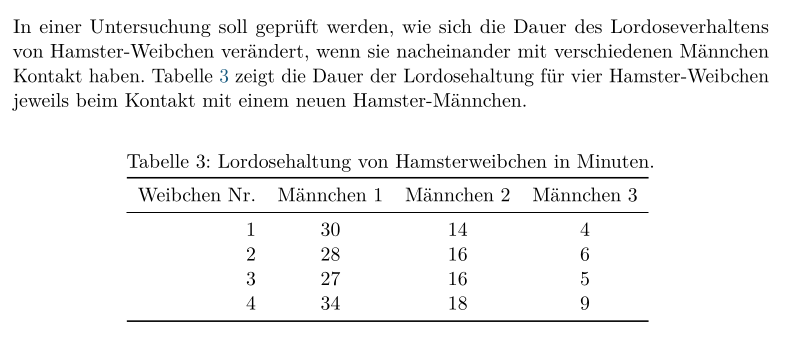
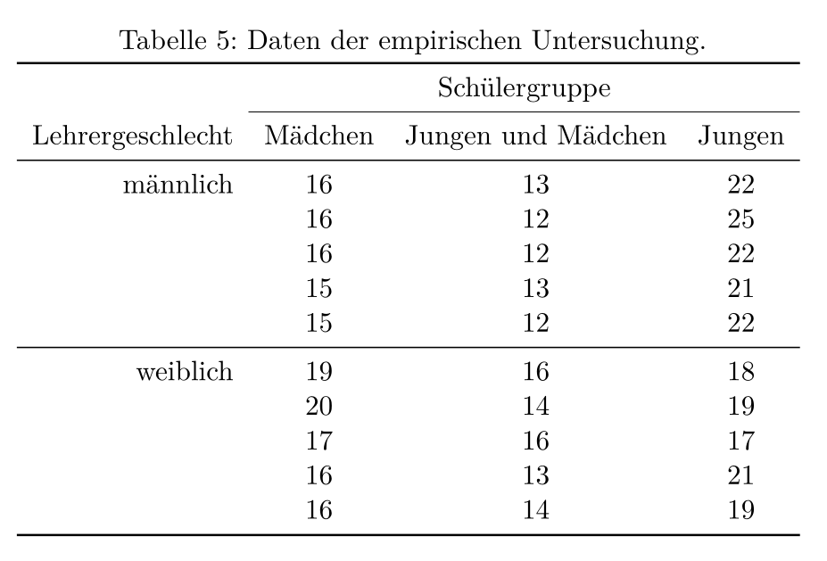
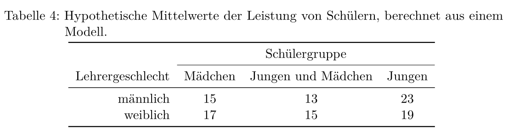
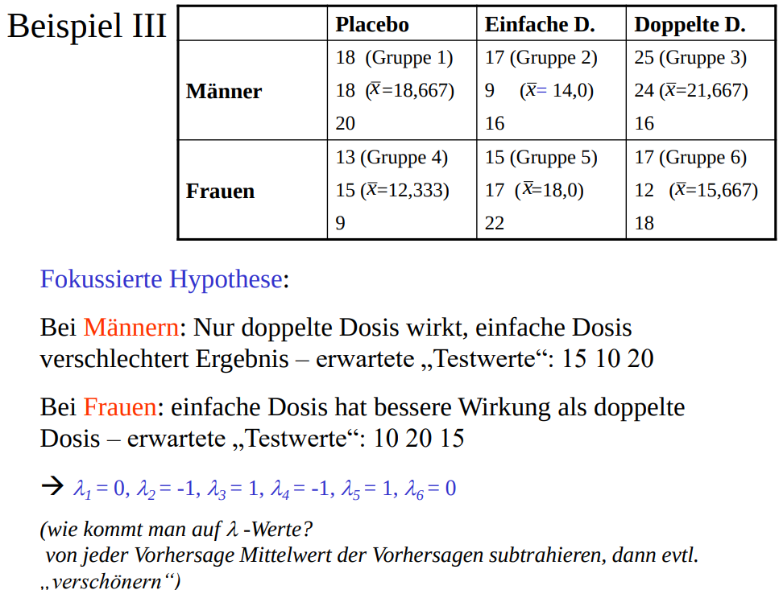
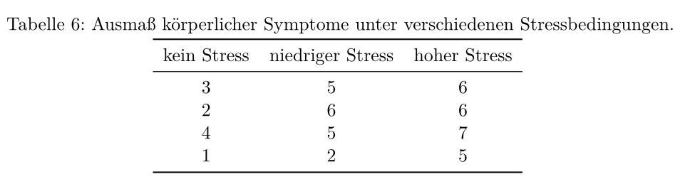
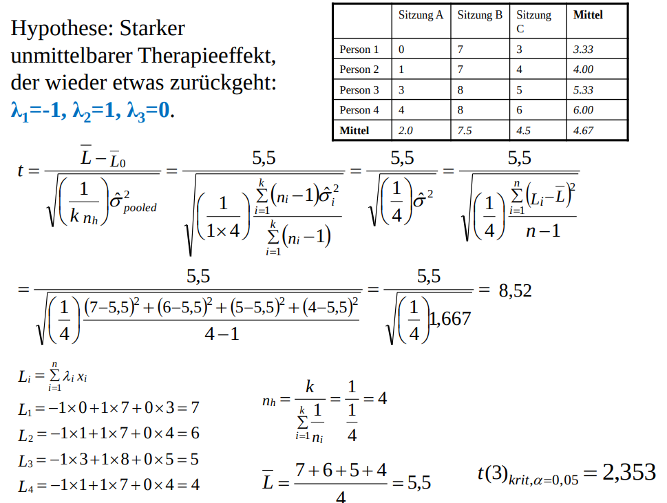

```{r setup, include=FALSE}
library(learnr)

library(ez)
library(dplyr)
library(tidyr)
library(cofad)

#  data sets -------
library(datarium)
# self-esteem data-set
data("selfesteem", package = "datarium")

selfesteem <- selfesteem %>%
  gather(key = "time", value = "score", t1, t2, t3)

data <- readRDS("data/ws19.RData")

vl <- data.frame(av = c(18, 18, 20, 13, 15, 9, 17, 9, 16, 15, 17, 22, 25, 24, 16,
                       17, 12, 18),
                 group = factor(rep(c("mp", "fp", "m1", "f1", "m2", "f2"),
                                    each = 3)))
musik <- data.frame(reading_test = c(27, 25, 30, 29, 30, 33, 31, 35,
                                     25, 26, 32, 29, 28, 30, 32, 34,
                                     21, 25, 23, 26, 27, 26, 29, 31, 
                                     23, 24, 24, 28, 24, 26, 27, 32),
                    participant = as.factor(rep(1:8, 4)),
                    music = as.factor(rep(c("without music", "white noise",
                                            "classic", "jazz"), each = 8)))
```

## Einführung
Nachdem wir die deskriptive Statistik so weit erst mal abgehandelt haben, machen wir heute Inferenzstatistik. Ich warne Dich schon mal vor: das wird etwas trocken und recht anstrengend, aber am Ende kannst Du dann schon ungefähr die Hälfte der Tests aus der Methodenlehre in `R` nachrechnen. Das ist wirklich praktisch, denn so kannst Du die Aufgaben aus der Übung nachprüfen. Bald bist Du vollkommen autonom was die Statistik angeht!

Wir fangen mit $t$-Tests an, behandeln anschließend die ANOVA und am Ende die Kontrastanalyse. Wir nutzen wieder die Vorlesungsdaten:

```{r, eval=FALSE}
data <- read.csv("https://www-user.tu-chemnitz.de/~titz/data4.csv")
```

```{r}
data
```

## t-Test

### Gegen eine Konstante
Der einfachste $t$-Test ist der gegen eine Konstante. Sagen wir mal die Körpergröße von Frauen in Deutschland ist 168cm. Wir wollen prüfen ob Psychologiestudentinnen in ihrer Körpergröße von 168cm signifikant abweichen bei einem $\alpha$-Niveau von 5%.

```{r}
t.test(data$groesse[data$Geschlecht == "weiblich" & data$Studium == "Psychologie"], mu = 168)
```

Wir übergeben den Vektor, den wir testen wollen (vorher filtern und selektieren!) und geben die Konstante über den Parameter `mu` an. Wir sehen, dass in unserer Stichprobe die Körpergröße bei 168.7cm liegt, gleichzeitig ist dieses Ergebnis nicht signifikant verschieden von 168cm. Die Wahrscheinlichkeit dieses Ergebnisses, sofern die 168cm in der Population korrekt ist, liegt bei 0.3977. Also durchaus wahrscheinlich.

Prüfe nun nach ob das gleiche für SeKo-Studentinnen gilt.

```{r konstante, exercise=TRUE}

```

```{r konstante-solution}
t.test(data$groesse[data$Geschlecht == "weiblich" & data$Studium == "Seko"], mu = 168)
```

```{r konstante-mpc, echo=FALSE}
question("Wie groß ist der t-Wert?",
  answer("1.3882", correct = TRUE),
  answer("2.3882"),
  answer("3.3882"),
  answer("4.3882"),
  answer("5.3882"),
  random_answer_order = T
)
```

### Unabhängige Stichproben
Für den $t$-Test bei zwei unabhängigen Stichproben prüfen wir ob es einen signifikanten Unterschied zwischen SeKo- und Psychologiestudierenden in den Mathepunkten gibt.

```{r}
t.test(data$Mathe[data$Studium == "Seko"], data$Mathe[data$Studium == "Psychologie"])
```

Wir übergeben also einfach die zwei Vektoren, die gegeneinander getestet werden sollen. Wir finden einen signifikanten Unterschied ($\alpha=5\%$), der $p$-Wert ist 0.0206. Merkwürdigerweise sind die Freiheitsgrade nicht 104 (wir haben 106 valide Messwerte, und die Freiheitsgrade sind $n-2$). Das liegt daran, dass hier ein Welch-Test gerechnet wurde, da die Varianzgleichheit als Voraussetzung verletzt ist. Wenn Du trotzdem einen $t$-Test haben willst, dann gib an, dass die Varianzen gleich sind:

```{r}
t.test(data$Mathe[data$Studium == "Seko"], data$Mathe[data$Studium == "Psychologie"],
       var.equal = TRUE)
```

Wird auch signifikant, mit einem noch kleineren $p$-Wert. Diesmal stimmen die Freiheitsgrade mit unserer Überlegung überein.

Rechne nun zur Übung einen $t$-Test für den Unterschied zwischen der Körpergröße von Männern und Frauen (ohne Trennung nach Studienfach). Gehe diesmal von der gerichteten Hypothese aus, dass Männer größer sind als Frauen. Finde den entsprechenden Parameter zur Not über eine Websuche oder die Hilfe. Gehe davon aus, dass Varianzgleichheit gegeben ist.

```{r unabhaengig, exercise=TRUE}

```

```{r unabhaengig-solution}
t.test(data$groesse[data$Geschlecht == "männlich"], data$groesse[data$Geschlecht == "weiblich"],
       var.equal = TRUE, alternative = "greater")
```

```{r unabhaengig-mpc, echo=FALSE}
question("Wie groß ist der p-Wert?",
  answer("7.336e-16", correct = TRUE),
  answer("0.03"),
  answer("0.01"),
  answer("9.3854"),
  answer("7.336e-11"),
  random_answer_order = T
)
```

```{r unabhaengig-mpc2, echo=FALSE}
question("Wie groß wäre der p-Wert, wenn die Hypothese ungerichtet wäre?",
  answer("Doppelt so groß im Vergleich zur gerichteten Hypothese.", correct = TRUE),
  answer("Halb so groß im Vergleich zur gerichteten Hypothese."),
  answer("Lässt sich aus der vorherigen Aufgabe nicht ableiten."),
  random_answer_order = T
)
```

### Abhängige Stichproben

Für abhängige Stichproben können wir uns den Unterschied zwischen dem Mögen von Hunden und Katzen anschauen:

```{r}
t.test(data$Hunde_m, data$Katzen_m, var.equal = TRUE, paired = TRUE)
```

Wir setzen also nur den Parameter `paired` auf `TRUE` und schon haben wir den Test von unabhängig auf abhängig geändert. Hier zeigt sich kein Unterschied in den AVs.

Rechne nun einen Test für den Unterschied zwischen den Deutsch- und Mathepunkten (diese sind natürlich abhängig). Vergleiche diesen anschließend mit der Version für unabhängige Stichproben. Gehe stets von gleichen Varianzen aus.

```{r abhaengig, exercise=TRUE}

```

```{r abhaengig-solution}
t.test(data$Deutsch, data$Mathe, paired = TRUE, var.equal = TRUE)
t.test(data$Deutsch, data$Mathe, paired = FALSE, var.equal = TRUE)
```

```{r abhaengig-mpc, echo=FALSE}
question("Wie ist das Verhältnis zwischen dem $p$-Wert für den unabhängigen und abhängigen Test?",
  answer("Der p-Wert für unabhängige Stichproben ist ungefähr doppelt so groß wie der p-Wert für abhängige Stichproben.", correct = TRUE),
  answer("Der p-Wert für unabhängige Stichproben ist ungefähr halb so groß wie der p-Wert für abhängige Stichproben."),
  answer("Der p-Wert für unabhängige Stichproben ist ungefähr gleich groß wie der p-Wert für abhängige Stichproben."),
  answer("Der p-Wert für unabhängige Stichproben ist ungefähr dreimal groß wie der p-Wert für abhängige Stichproben."),
  random_answer_order = T
)
```

Es macht also einen gewaltigen Unterschied, ob der Test abhängig oder unabhängig ist!

### $t$-Test für Korrelation
Man kann auch für Korrelationen ein $t$-Test rechnen. Das geht am einfachsten über `cor.test`

```{r}
cor.test(data$Mathe, data$Deutsch)
```

Standardmäßig wird gegen eine Korrelation von 0 getestet. Hier sehen wir, dass die Korrelation zwischen Mathe- und Deutschpunkten (0.48) eine extrem kleine Auftretens-Wahrscheinlichkeit hat sofern die Korrelation in der Population tatsächlich 0 ist.

Probier das ganze nun selbst für die Korrelation zwischen den Variablen Sport und Lebenszufriedenheit:

```{r cor, exercise=TRUE}

```

```{r cor-solution}
cor.test(data$Sport, data$Lebenszufriedenheit)
```

```{r cor-mpc, echo=FALSE}
question("Wie groß ist der t-Wert?",
  answer("2.0557", correct = TRUE),
  answer("1.0533"),
  answer("-1.0533"),
  answer("-2.0533"),
  answer("-2.0557"),
  random_answer_order = T
)
```

### Konfidenzintervalle

Konfidenzintervalle haben wir bei allen bisherigen Tests stets angezeigt bekommen. Deshalb verzichte ich hier auf eine gesonderte Behandlung. Man kann auch immer die Konfidenz festlegen (Parameter `conf.level`). Es gibt sicher ein Dutzend Pakete, die Konfidenzintervalle extra berechnen können. Aber bisher haben wir keine Extrawünsche, also benutzen wir base `R`. Nur zur Übung, berechne mir das 99%-Konfidenzintervall für den Mittelwertsunterschied in der Lebenszufriedenheit zwischen weiblichen und männlichen Studierenden über die Funktion `t.test`. Geh von Varianzgleichheit aus.

```{r conf, exercise=TRUE}

```

```{r conf-solution}
t.test(data$Lebenszufriedenheit[data$Geschlecht == "weiblich"],
       data$Lebenszufriedenheit[data$Geschlecht == "männlich"],
       var.equal = TRUE, conf.level = .99)
```

```{r conf-mpc, echo=FALSE}
question("Wie weit reicht das Intervall?",
  answer("-1.03 bis 1.13", correct = TRUE),
  answer("-0.66 bis 0.77"),
  answer("0.55 bis 0.9"),
  answer("1.32 bis 1.6"),
  answer("-1.20 bis 1.20"),
  random_answer_order = T
)
```

## ANOVA

Am einfachsten und konsistentesten ist die ANOVA im `ez`-Package implementiert. Es gibt zwar auch `aov` und mit `lm` geht es auch, aber dort kommt man schnell durcheinander oder bekommt nicht den Output, den man gerne hätte. Das Paket müssen wir natürlich erst mal installieren und laden (wenn Du in R oder RStudio arbeitest, ist dieser Schritt zwingend notwendig):

```{r, eval=FALSE}
install.packages("ez")
library("ez")
```

### Unabhängige Stichproben

Nun rechnen wir die erste ANOVA. Wir schauen uns an ob die Abinote vom Geschlecht und dem Ernährungsstil abhängt:

```{r}
ezANOVA(data = data, wid = id, between = c(Vegetarier, Geschlecht), dv = Abi)
```

`ezANOVA` warnt uns vor ein paar Dingen. Es transformiert von alleine die Variablen in Faktoren und sagt uns, dass unser Design nicht balanciert ist. Wir kommen später nochmal darauf zu sprechen. 

Interpretieren wir erst mal das Ergebnis und schauen uns anschließend die Syntax an. Zu erkennen ist ein Haupteffekt des Geschlechts, mit einem großen $F$-Wert, einem kleinen $p$-Wert und einer Varianzaufklärung von ungefähr 5% (hier **ges**). Levens Test für Varianzhomogenität ist nett, brauchen wir aber üblicherweise nicht. Wenn man nun wissen möchte, welches Geschlecht im Schnitt eine bessere Abiturnote hat, muss man sich die Daten genauer anschauen. Man wird üblicherweise einfach eine Abbildung erstellen. Welche genau, hängt von verschiedenen Faktoren ab. Wir machen hier einen Boxplot:

```{r}
boxplot(Abi~Vegetarier+Geschlecht, data = data)
```

Die Männer scheinen etwas schlechter abzuschneiden.

Nun zur Syntax, schauen wir uns diese nochmal genau an:

```{r, eval=FALSE}
ezANOVA(data = data, wid = id, between = c(Vegetarier, Geschlecht), dv = Abi)
```

Der Parameter `wid` gibt die ID für die Person an. Diese ist zwingend notwendig, da bei Within-Designs mehrere Messungen pro Person vorhanden sind. Um alles konsistent zu halten wird sie auch bei einer reinen between-ANOVA benötigt. `between` nimmt die UVs auf und `dv` (dependent variable) die AV. Über den Parameter `data` spezifizieren wir den Dataframe in dem die Variablen id, Vegetarier, Geschlecht und Abi vorhanden sind. Tatsächlich ist das eine Besonderheit, denn bisher haben wir Variablennamen eher in Anführungszeichen geschrieben: z. B.  `data[, c("Vegetarier", "Geschlecht")]`. Bei der `ez`-Syntax ist das nicht notwendig, man kann (oder eher muss) direkt die Variablennamen hinschreiben. Falls Du mal Fehlermeldungen bekommen solltest, prüfe in beide Richtungen, ob Du Anführungszeichen eventuell vergessen oder fälschlicherweise gesetzt hast (bei anderen Befehlen als `ez`).

Das Folgende ist falsch, da Abi nicht in Anführungszeichen gesetzt werden darf:
```{r, error=TRUE, warning=FALSE}
ezANOVA(data = data, wid = "id", between = c(Vegetarier, Geschlecht), dv = "Abi")
```

Auch das Folgende ist falsch, da hier die Variablen in Anführungszeichen gesetzt werden müssen.
```{r, error=TRUE}
data[, c(Vegetarier, Geschlecht)]
```

Warum ist `R` so kompliziert? Weil Flexibilität ihren Preis hat!

<!-- Genug Exkurs, üblicherweise wollen wir noch eine schöne Grafik zur ANOVA haben: -->
<!-- ```{r, warning=F} -->
<!-- library(ggplot2) -->

<!-- ezANOVA(data = data, wid = id, between = c(Vegetarier, Geschlecht), dv = Abi) -->
<!-- ``` -->

<!-- Der Output passt gut zur Grafik. Wir sehen einen Effekt des Geschlechts und eine Interaktion, jedoch keinen Effekt der Ernährungsform. -->

Die Aufmerksamen unter Euch fragen Sich nun vielleicht noch warum beim ANOVA-Output **ges** der Effekt ist (letzte Spalte im Output). ges  ist das generalized Eta-Squared. Wenn Du altbekannte Effektgrößen berechnen willst, dann stell noch `detailed=TRUE` ein: 

```{r}
ezANOVA(data = data, wid = id, between = c(Vegetarier, Geschlecht), dv = Abi,
        detailed = TRUE)
```

Jetzt kannst Du über die SS (Sum of Squares) $\eta^2$ und $\eta_p^2$ *per Hand* berechnen. 

Nun, um ganz ehrlich zu sein haben wir hier eine unbalancierte ANOVA und davor warnt uns `ezANOVA` auch. $\eta^2$ ist somit nicht genau der Wert, den wir bei einer Berechnung per Hand bekämen. Das kannst Du nachprüfen, in dem Du mal aus dem $F$-Wert $\eta^2$ berechnest (klar geht das!) und mal aus den Quadratsummen. Die Formelsammlung ist Dein Freund. Zugriff auf die Werte bekommst Du folgendermaßen:

```{r, warning=FALSE, message=FALSE}
meineanova <- ezANOVA(data = data, wid = id, between = c(Vegetarier, Geschlecht), dv = Abi,
                      detailed = TRUE)
meineanova$ANOVA$F
meineanova$ANOVA$SSn
meineanova$ANOVA$SSd
```

Dann rechne mal den Effekt für den Faktor Geschlecht (1) über den $F$-Wert und (2) über die Quadratsummen:

```{r anova-effect, exercise=TRUE, eval = TRUE, warning=FALSE}
meineanova <- ezANOVA(data = data, wid = id, between = c(Vegetarier, Geschlecht), dv = Abi,
                      detailed = TRUE)
```

```{r anova-effect-solution}
meineanova <- ezANOVA(data = data, wid = id, between = c(Vegetarier, Geschlecht), dv = Abi,
                      detailed = TRUE)
# F/(F+df_inn)
meineanova$ANOVA$F[2]/(meineanova$ANOVA$F[2]+103)
# QS_Geschlecht/(QS_Gesamt)
meineanova$ANOVA$SSn[2]/(sum(meineanova$ANOVA$SSn)+meineanova$ANOVA$SSd[1])
```

```{r anova-mpc, echo=FALSE}
question("Wie groß ist Eta-Quadrat für den Faktor Geschlecht wenn man es aus dem F-Wert berechnet?",
  answer("0.0457", correct = TRUE),
  answer("0.0557"),
  answer("0.0345"),
  answer("0.0444"),
  answer("0.0631"),
  random_answer_order = T
)
```

```{r anova2-mpc, echo=FALSE}
question("Wie groß ist Eta-Quadrat für den Faktor Geschlecht wenn man es aus den Quadratsummen berechnet?",
  answer("0.0456", correct = TRUE),
  answer("0.0457"),
  answer("0.0345"),
  answer("0.0444"),
  answer("0.0631"),
  random_answer_order = T
)
```

Ja, der Unterschied ist nicht groß, aber er ist vorhanden und man muss ihn irgendwie erklären. Des Rätsels Lösung liegt, wie schon angedeutet, darin, dass unsere ANOVA nicht balanciert ist. Wir haben nicht gleich viele Personen in den vier Bedingungen. Wenn wir jetzt diskutieren was man da machen kann, sitzen wir noch morgen hier. Merk Dir: Du machst Dir und allen anderen Menschen das Leben viel einfacher, wenn Du ein balanciertes Design hast. Das erreichst Du durch ein richtiges Experiment (UV manipulieren, AV messen, zufällige Zuweisung der Probanden auf die Bedingungen), bei dem alle Zellen gleich viele Probanden haben. Fertig!

Okay, genug geredet. Rechne nun eine ANOVA für die Lebenszufriedenheit in Abhängigkeit von den Faktoren Meditation und Haustier.

```{r anova, exercise=TRUE}

```

```{r anova-solution}
ezANOVA(data = data, wid = id, between = c(Meditation, Haustier),
        dv = Lebenszufriedenheit,
        detailed = TRUE)
```

```{r anova3-mpc, echo=FALSE}
question("Wie groß ist die Quadratsumme für den Faktor Meditation?",
  answer("10.998", correct = TRUE),
  answer("6.997"),
  answer("0.128"),
  answer("7.342"),
  answer("5.112"),
  random_answer_order = T
)
```

### Abhängige Stichproben
Wie sieht's mit einer abhängigen ANOVA aus? Wir können diesmal die Daten aus der Übung verwenden:

<hr>

<hr>

Datenerstellung in `R` und eine Within-ANOVA:
```{r}
d <- data.frame(dv_lordose = c(30, 28, 27, 34, 14, 16, 16, 18, 4, 6, 5, 9),
                wid =  paste("Weibchen", 1:4),
                iv_pos = paste("Männchen", rep(1:3, each = 4)))
ezANOVA(data = d, wid = wid, dv = dv_lordose, within = iv_pos, detailed = T)
```

Genau das Selbe kommt in der Übung (per Hand) heraus. Das heißt, von nun an brauchst Du die Lösungen nicht mehr auf dem Lösungsblatt nachzuprüfen, sondern kannst sie alle direkt in `R` nachrechnen. Besonders praktisch, wenn die Dozenten so extrem langsam sind beim Hochladen von Lösungen!

Jetzt bist Du dran. Ich habe Dir einen Datensatz mit Namen `selfesteem` vorbereitet.

```{r}
selfesteem
```

Zu drei Messzeitpunkten während einer Diät wurde das Selbstbewusstsein für 10 Personen erfasst. Beachte wie die Daten angeordnet sind. Die drei Messungen sind nicht in verschiedenen Spalten. Stattdessen gibt es eine Variable, die die Messung kodiert (time) und eine die die AV kodiert (score), genau so wie wir es für `ezANOVA` brauchen. Rechne nun eine within-ANOVA und gib zusätzlich Boxplots pro Bedingung an.

```{r within, exercise=TRUE}

```

```{r within-solution}
ezANOVA(data = selfesteem, wid = id, dv = score, within = time,
        detailed = T)
boxplot(score~time, data = selfesteem)
```

```{r anova-within-mpc, echo=FALSE}
question("Wie groß ist der Effekt des Zeitpunkts?",
  answer(".83", correct = TRUE),
  answer(".73"),
  answer(".63"),
  answer(".53"),
  answer(".93"),
  random_answer_order = T
)
```


```{r anova-within-mpc2, echo=FALSE}
question("Wie genau äußert sich der Effekt des Zeitpunkts?",
  answer("Das Selbstbewusstsein steigt über die Zeit hinweg an.", correct = TRUE),
  answer("Das Selbstbewusstsein steigt über die Zeit zunächst an, fällt dann aber wieder ab."),
  answer("Das Selbstbewusstsein ändert sich über die Zeit nicht."),
  answer("Das Selbstbewusstsein sinkt über die Zeit hinweg ab."),
  answer("Es gibt kein eindeutiges Muster, da die Fehlervarianz zu groß ist."),
  random_answer_order = T
)
```

Übrigens: Mit `ezANOVA` ist es auch kein Problem gemischte Designs (between und within kombiniert) zu rechnen, Du musst nur `within` und `between` gemeinsam spezifizieren.

## Kontrastanalyse

### Unabhängige Stichproben
Bleibt nur noch die Kontrast-Analyse. Wir schauen uns zunächst ein Beispiel aus der Übung an. Das Lehrergeschlecht (männlich, weiblich) und die Schülerzusammensetzung (nur männlich, nur weiblich, männlich und weiblich) sind UVs:



In R erstellen wir erst mal die Daten:

```{r}
av <- c(16, 16, 16, 15, 15, 19, 20, 17, 16, 16, 13, 12, 12, 13, 12, 16, 14, 16, 13, 14, 22, 25,
        22, 21, 22, 18, 19, 17, 21, 19)
group <- as.factor(rep(c("mw", "ww", "mg", "wg", "mm", "wm"), each = 5))
d <- data.frame(av, group)
d
```

Der erste Buchstabe steht für das Lehrergeschlecht, der zweite für die Zusammensetzung der Schüler (Beispiel "mw" = männlicher Lehrer, weibliche Schüler).

In der Übung kamen wir auf ein $r_\mathrm{effect size}$ von 0.93. Wir schauen erst mal, ob wir das reproduzieren können. Dafür erstellen wir uns die Lambdas, die sich aus folgenden hypothetischen Mittelwerten ergeben:



```{r}
mw <- c(15, 17, 13, 15, 23, 19)
lambda <- rep(mw-mean(mw), each = 5)
```

Das `rep` mit `each=5` brauchen wir, da wir für jede Person ein Lambda benötigen -- dieses ist für die einzelnen Gruppen konstant (5 Personen pro Gruppe). Nun korrelieren wir die Lambdas mit den Werten der AV:

```{r}
cor(av, lambda)
```

Hier sieht man ganz konkret, dass $r_\mathrm{effect size}$ die Korrelation zwischen Lambdas und der abhängigen Variable ist (auf Individumebene).

Um die Kontrastanalyse normal zu berechnen können wir das Paket ``cofad`` benutzen (das haben zwei außergewöhnlich talentierte R-Programmier geschrieben):

```{r, eval=FALSE}
install.packages("cofad")
library(cofad)
```

Und nun die Berechnung:
```{r}
calc_contrast(dv = av, between = group, 
              lambda_between = c("mw" = -1, "ww" = 0, "mg" = -2, "wg" = -1, 
                                 "mm" = 3, "wm" = 1), data = d)
```

Die Syntax hat eine Besonderheit: die Lambdas werden mit dem entsprechenden Namen der Subgruppe angegeben. Zum Beispiel soll Subgruppe **mw**  das Lambda -1 bekommen (`"mw" = -1`). Diese Syntax verhindert eine falsche Zuordnung der Lambdas, was ansonsten schnell mal passieren könnte. Der Output ist im Normalfall nicht besonders ausführlich, aber wir können uns auch Quadratsummen anzeigen lassen über die `summary`-Funktion:

```{r}
summary(calc_contrast(av, between = group, 
                      lambda_between = c("mw" = -1, "ww" = 0, "mg" = -2,
                                         "wg" = -1, "mm" = 3, "wm" = 1),
                      data = d))
```

Nun bist du an der Reihe. Ich habe Dir Daten aus der Vorlesung vorbereitet (Folie 13):

<hr>

<hr>

In `R` sieht der Dataframe so aus:
```{r}
vl <- data.frame(av = c(18, 18, 20, 13, 15, 9, 17, 9, 16, 15, 17, 22, 25, 24, 16,
                       17, 12, 18),
                 group = factor(rep(c("mp", "fp", "m1", "f1", "m2", "f2"), each = 3)))
vl
```

Es geht um die Wirkung eines Medikaments in Abhängigkeit des Geschlechts und der Dosis (m und f steht für Männer und Frauen, p ist Placebo, 1 und 2 sind einfache und doppelte Dosis)

Rechne dafür eine Kontrast-Analyse. Die Kontraste sollen sein: mp = 0, fp = -1, m1 = -1, f1 = 1, m2 = 1 und f2 = 0.

```{r kontr, exercise=TRUE}

```

```{r kontr-solution}
calc_contrast(dv = av, between = group, 
              lambda_between = c("mp" = 0, "fp" = -1, "m1" = -1, "f1" = 1,
                                 "m2" = 1, "f2" = 0),
              data = vl)
```


```{r kontr-mpc, echo=FALSE}
question("Wie groß ist $r_\\mathrm{effect size}$?",
  answer("0.638", correct = TRUE),
  answer("0.680"),
  answer("0.878"),
  answer("0.543"),
  answer("0.137"),
  random_answer_order = T
)
```

### Abhängige Stichproben

Für abhängige Stichproben ist die Kontrast-Analyse viel einfacher -- sowohl konzeptuell als auch in der Berechnung. Wir können diese direkt *per Hand* berechnen. Als Beispiel nehmen wir die Aufgabe aus der Übung:

*Sie haben in einer Untersuchung bei vier Probanden das Ausmaß körperlicher Symptome (auf einer Skala von 0 (keine Symptome) bis 10 (sehr starke Symptome)) unter verschiedenen Stressbedingungen bestimmt. Laut ihrer Hypothese sollte die Stärke der Symptome von der Bedingung ohne Stress zur Bedingung mit niedrigem Stress um 10\% zunehmen. Von der Bedingung mit niedrigem Stress zu der mit hohem Stress sollte sich die Stärke der Symptome verdoppeln.*

Die Daten sind:



In `R` erstellen wir uns den Dataframe und führen die Berechnung durch:

```{r}
av <- matrix(c(3, 2, 4, 1, 5, 6, 5, 2, 6, 6, 7, 5), ncol = 3)
lambdas <- c(-2.6, -2, 4.6)
lk <- av %*% lambdas
t.test(lk)
```

Was wir hier machen ist einfach die Lambdas mit den Werten der Personen zu multiplizieren und pro Person die Summe zu bilden. Das ist die Kovariation zwischen Lambdas und den Werten der Probanden. Mit dem $t$-Test testen wir anschließend ob diese Kovariation überzufällig größer ist als 0.

Das einzig neue ist die Operation `%*%`, das ist das Symbol für Matrix-Multiplikation und kürzt die Berechnung deutlich ab.

Wir können natürlich auch wieder `cofad` verwenden:

```{r}
stress <- data.frame(av = c(3, 2, 4, 1, 5, 6, 5, 2, 6, 6, 7, 5),
                     group = factor(rep(c("t1", "t2", "t3"), each = 4)),
                     participant = factor(rep(1:4, 3)))
calc_contrast(dv = av, 
              within = group,
              lambda_within = c("t1" = -2.6, "t2" = -2, "t3" = 4.6),
              ID = participant,
              data = stress)
```

Es kommt der gleiche $t$-Wert heraus (8.1).

Jetzt kannst Du es probieren. Ich habe Dir aus dem Buch von Prof. Sedlmeier ein Beispiel vorbereitet (Tabelle 16.5):

```{r}
musik <- data.frame(reading_test = c(27, 25, 30, 29, 30, 33, 31, 35,
                                     25, 26, 32, 29, 28, 30, 32, 34,
                                     21, 25, 23, 26, 27, 26, 29, 31, 
                                     23, 24, 24, 28, 24, 26, 27, 32),
                    participant = as.factor(rep(1:8, 4)),
                    music = as.factor(rep(c("without music", "white noise",
                                            "classic", "jazz"), each = 8)))
musik
```

Die Lesefähigkeit wurde von 8 Probanden unter verschiedenen Bedingungen erfasst. Die Hypothese ist, dass man ohne Musik am besten lesen kann, mit weißem Rauschen etwas schlechter und mit Musik noch schlechter. Rechne hierfür eine Kontrastanalyse für abhängige Stichproben. Die Lambdas sind 1.25, 0.25, -0.75, -0.75.

```{r kontrwithin, exercise=TRUE}

```

```{r kontrwithin-solution}
calc_contrast(dv = reading_test, within = music,
              lambda_within = c("without music" = 1.25, 
                                "white noise" = 0.25, "classic" = -0.75,
                                "jazz" = -0.75),
              ID = participant, data = musik)
```


```{r kontrwithin-mpc, echo=FALSE}
question("Wie groß ist $g_\\mathrm{contrast}$?",
  answer("1.863", correct = TRUE),
  answer("0.721"),
  answer("1.321"),
  answer("-1.230"),
  answer("0.937"),
  random_answer_order = T
)
```

Gut gemacht! Der Tag war ziemlich "intense". Wir haben den Großteil der Signifikanztests aus der Methodenlehre behandelt -- in nur einer Sitzung! Ziemlich trocken, aber vielleicht hast Du auch hier und da gemerkt was man aus Daten rauskitzeln kann. Zum Beispiel sind Männer signifikant größer als Frauen und das Abitur in unserer Stichprobe ist abhängig vom Geschlecht. Das sind keine überragenden Erkenntnisse, aber von nun an hast Du das Werkzeug um eigene Fragestellungen statistisch zu untersuchen. Wolltest Du nicht schon immer mal wissen welche Unterschiede und Gemeinsamkeiten es zwischen Menschen gibt? Mach eine Umfrage unter Deinen Freunden. Oder vermiss Dich selbst: fang an zu laufen und tracke die Geschwindigkeit über die Zeit. Wirst Du signifikant besser? Fang an zu meditieren und tracke Dein Stressniveau! Wie groß ist der Effekt? Du bist längst so weit eigenständig Daten zu sammeln und auszuwerten. Dawai, dawai! 

Falls Du zur langweiligen Sorte gehörst kannst Du natürlich auch noch ein paar Wiederholungsaufgaben lösen. :)

## Übungsaufgaben Tag 4

### $t$-Test
In Methodenlehre I haben wir einen $t$-Test für folgende Tabelle gerechnet:

|EG   | KG   |
|:---:|:----:|
|-0.09| -0.26|
|0.01 | -0.26|
|0.03 |-0.21 |
|-0.31| -0.08|
|0.34 |      |

Die Experimentalgruppe bekam ein Medikament, die Kontrollgruppe ein Placebo. Die AV ist die Flugleistung in einem Simulator. Die Probanden waren erfahrene Piloten.

Rechne den Test in `R` nach (kleine Abweichungen zur Berechnung per Hand können durch Rundungsfehler entstehen). Geh von Varianzhomogenität aus.

```{r ttest2, exercise=TRUE}

```

```{r ttest2-solution}
t.test(c(-.09, .01, .03, -.31, .34), c(-.26, -.26, -.21, -.08), var.equal=TRUE)
```

```{r tuebung-mpc, echo=FALSE}
question("Wie groß ist der $p$-Wert??",
  answer("0.1558", correct = TRUE),
  answer("0.2370"),
  answer("-0.329"),
  answer("0.0500"),
  answer("0.1189"),
  random_answer_order = T
)
```

### Eigene Funktion für $t$-Test

Schreibe eine eigene Funktion um den $t$-Wert zu berechnen. Nutze dafür notfalls die Formeln aus der Formelsammlung. Die Funktion sollte als Parameter zwei Vektoren haben. Als Rückgabewert den $t$-Wert. Du kannst natürlich die Funktionen `mean` und `var` einsetzen. Zur Überprüfung, ob Deine Funktion funktioniert, rechne nochmal den $t$-Test aus der vorherigen Aufgabe.

```{r funktion, exercise=TRUE}

```

```{r funktion-solution}
mein_t_test <- function(x, y){
  diff <- mean(x)-mean(y)
  n1 <- length(x)
  n2 <- length(y)
  se_pooled <- sqrt(((n1-1)*var(x)+(n2-1)*var(y))/(n1+n2-2)*(1/n1+1/n2))
  diff/se_pooled
}
mein_t_test(c(-.09, .01, .03, -.31, .34), c(-.26, -.26, -.21, -.08))
```

### Kontrastanalyse

Rechne die Kontrastanalyse aus der Vorlesung auf Folie 21 mit `cofad` nach:

<hr>

<hr>


```{r kauebung, exercise=TRUE}

```


```{r kauebung-solution}
therapie <- data.frame(av = c(0, 1, 3, 4, 7, 7, 8, 8, 3, 4, 5, 6),
                       participant = as.factor(rep(1:4, 3)),
                       group = as.factor(rep(c("A", "B", "C"), each = 4)))
calc_contrast(dv = av, within = group,
              lambda_within = c("A" = -1, "B" = 1, "C" = 0),
              ID = participant, data = therapie)
```

```{r kauebung-mpc, echo=FALSE}
question("Wie groß ist $g_\\mathrm{contrast}$?",
  answer("4.26", correct = TRUE),
  answer("1.73"),
  answer("-1.32"),
  answer("3.05"),
  answer("1.18"),
  random_answer_order = T
)
```

### ANOVA
Rechne die ANOVA aus der Vorlesung auf Folie 12 nach:

<hr>

<hr>

```{r avuebung, exercise=TRUE}

```

```{r avuebung-solution}
vlf12 <- data.frame(av = c(18, 18, 20, 13, 15, 9, 17, 9, 16, 15, 17, 22, 25, 
                           24, 16, 17, 12, 18),
                    wid = 1:18,
                    geschlecht = factor(rep(c(c("m", "m", "m"), c("f", "f", "f")), 3)),
                    medikament = factor(rep(c("p", "1", "2"), each = 6)))
ezANOVA(data = vlf12, dv = av, between = c(geschlecht, medikament), wid = wid)
```


```{r anovauebung-mpc, echo=FALSE}
question("Wie groß ist der $F$-Wert für die Interaktion?",
  answer("4.01", correct = TRUE),
  answer("4.73"),
  answer("-1.32"),
  answer("3.05"),
  answer("2.18"),
  random_answer_order = T
)
```
