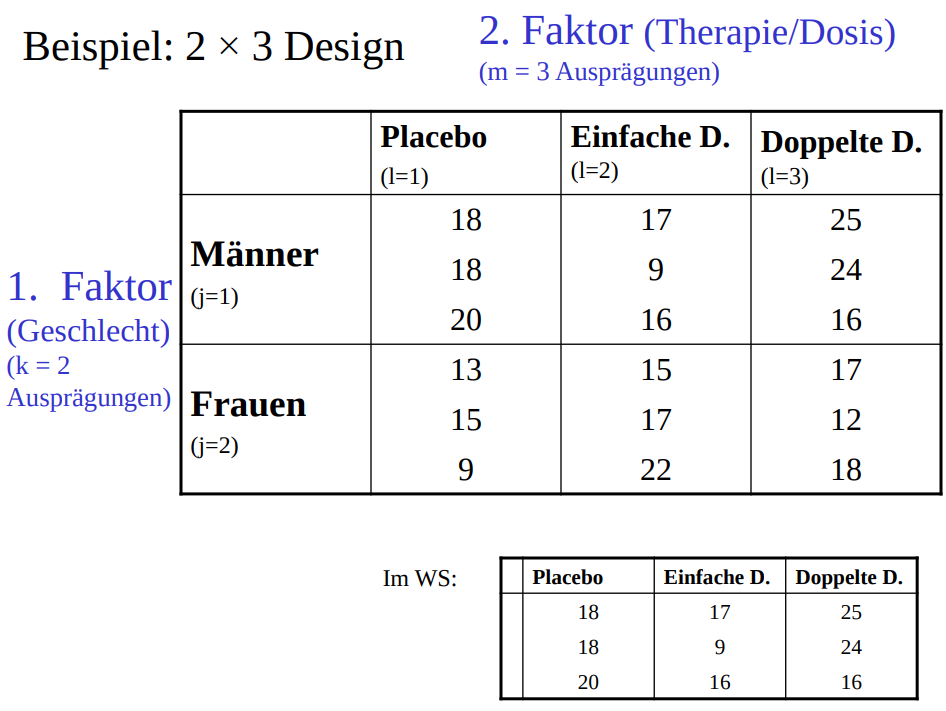

```{r setup, include=FALSE}
library(learnr)
library(ez)

library(sjPlot)

#knitr::opts_chunk$set(fig.width=7, fig.height=4.9)
data <- readRDS("data/ws19.RData")
imdb <- readRDS("data/imdb.RData")
imdb$age <- 2020 - imdb$title_year
imdb$film <- imdb$duration > 75
imdb$action <- grepl("Action", imdb$genres)

av <- matrix(c(2, 1, 3, 3, 1, 3, 4, 3, 5, 0, 6, 8, 7, 4, 10, 5, 5, 5, 3, 2))
unterricht <- data.frame(av = av, 
                   uv = rep(c("Gruppenunterricht", "Selbststudium",
                              "Einzelunterricht","ELearning"), each = 5),
                   wid = 1:20)
vlf5 <- data.frame(av = matrix(c(18, 18, 20, 17, 9, 16, 25, 24, 16)),
                   gruppe = rep(c("placebo", "einfache Dosis", "doppelte Dosis"), each = 3))
vlf5
```

## Einführung

Regression ist das Allheilmittel der Psychologie, denn sie ist nicht nur von selbst sehr nützlich, auch kann man mit ihr die am häufigsten verwendeten Verfahren wie ANOVA und $t$-Test berechnen. Wenn also ein Methode der Statistik wirklich wichtig für Psychologen ist, so ist das die Regression. Deshalb schauen wir sie uns heute etwas genauer an. Wir fangen mit einem einfachen Beispiel an, bei dem wir die Bewertung von Filmen vorhersagen möchten. Dann versuchen wir die Äquivalenz zum $t$-Test und zur ANOVA aufzuzeigen. Anschließend kommt der Höhepunkt: mit einer linearen Regression lassen sich auch nicht-lineare Zusammenhänge modellieren. Linear ist nicht gleich linear! Zum Schluss schauen wir uns zwei einfache Wege an zu standardisierten Regressionskoeffizienten zu kommen, die `R` standardmäßig nicht ausgibt.

## Filmbewertungen vorhersagen

Vielleicht erinnerst Du Dich noch an die Filme-Datenbank aus Tag 2. Stell Dir vor Du kennst eine großartige Schauspielerin, die nur in großartigen Filmen mitspielen will. Die Schauspielerin beauftragt Dich ein Modell zu entwickeln mit dem sie entscheiden kann, welche Rollenangebote sie annimmt und welche sie ablehnt.

Laden wir uns erst mal die Daten:

```{r, eval=FALSE}
imdb <- read.csv("https://raw.githubusercontent.com/devashishpatel/IMDB-Top-5000/master/movie_metadata.csv")
```

```{r}
imdb
```

Da die Regressions-Analyse Intervallskalenniveau voraussetzt, schaust Du Dir die entsprechenden Variablen an und nimmst explorativ zunächst das Budget des Films, die Filmlänge und das Alter ins Modell. Das ist nicht völlig atheoretisch; mehr Geld sollte zu besseren Filmen führen, zu kurze oder zu lange Filme könnten schlechter bewerten werden und ältere Filme polarisieren vermutlich.

Bevor wir das Modell bauen, müssen wir das Alter des Filmes aus dem Erscheinungsjahr berechnen:

```{r}
imdb$age <- 2020 - imdb$title_year
```

Und nun das Modell:

```{r}
model1 <- lm(imdb_score ~ budget + duration + age, data = imdb)
summary(model1)
```
Mit `lm` machen wir ein **l**ineares **M**odell, was äquivalent zu einer Regression ist. Die Syntax bedient sich hier der Formelsprachweise von `R`. Zunächst kommt die AV, dann die Tilde `~` und dann die UVs mit einem `+` voneinander getrennt. Genau wie beim Boxplot mit mehreren UVs (siehe Tag 3). Schließlich sagen wir `lm` noch in welchem Datensatz sich diese Variablen befinden. Das ist sehr praktisch, ansonsten müssten wir immer wieder `data$` vor die Variablen schreiben (`data$imdb_score ~ data$action + ...`), was viel mehr Tipparbeit wäre.

Der Output erfolgt dann am einfachsten über `summary`, wobei dies zugegebenerweise etwas unübersichtlich ist. Wir können uns hier eines schönen Pakets von Daniel Lüdecke bedienen:
```{r, eval=FALSE}
install.packages(sjPlot)
library(sjPlot)
```

Und nun:

```{r}
tab_model(model1)
```

Das ist mehr als nur gut und lässt Deinen Abschluss-Arbeits-Betreuer, der nur SPSS kann, ganz schön staunen!

```{r model1-mpc1, echo=FALSE}
question("Wie kann man den Einfluss des Alters eines Films auf seine Bewertung interpretieren?",
  answer("Pro Jahr im Alter des Films, steigt die Bewertung um 0.01 Punkte auf der IMDB-Skala.", correct = TRUE),
  answer("Pro Jahr im Alter des Films, sinkt die Bewertung um 0.01 Punkte auf der IMDB-Skala."),
  answer("Pro 0.01 Jahre im Alter des Films, steigt die Bewertung um 1 Punkt auf der IMDB-Skala."),
  answer("Pro 0.01 Jahre im Alter des Films, sinkt die Bewertung um 1 Punkt auf der IMDB-Skala."),
  random_answer_order = T
)
```

```{r model1-mpc2, echo=FALSE}
question("Welche Bewertung bekommt ein Film, der 0 Jahre alt ist und 120 Minuten geht. (Ignoriere hierfür den Effekt des Budgets.)",
  answer("6.83", correct = TRUE),
  answer("4.46"),
  answer("4.43"),
  answer("7.21"),
  answer("5.98"),
  random_answer_order = T
)
```

Überraschenderweise hat das Budget keinen Einfluss auf die Bewertung, aber durchaus die Länge des Films. Wir erinnern uns, dass bei IMDB auch Serien enthalten sind, die eventuell generell schlechter bewertet werden als Filme. Aber die Variable Film/Serie ist ja nicht intervallskaliert, also können wir sie nicht in die Regression aufnehmen. Falsch gedacht! Es spricht nichts dagegen dichotome Variablen in eine Regression aufzunehmen:

```{r}
imdb$film <- imdb$duration > 75
```

```{r}
model2 <- lm(imdb_score ~ budget + duration + age + film, data = imdb)
tab_model(model2)
```
Der Effekt der Serie lässt sich hier einfach als Mittelwertsunterschied lesen. Wenn `film == 0`, dann ist es eine Serie und wir sind bei einer Schätzung von 5.33 (wenn budget, duration und age 0 wären). Ist es ein Film, dann müssen wir 1.02 abziehen. Heißt also einfach nur, dass Serien generell besser bewertet werden -- überraschend, denn spontan hätte ich das Gegenteil erwartet. Aber vielleicht ist der Grund für die bessere Bewertung von Serien ein Selektionsprozess: Personen, denen die Serie gefällt (Fans also) machen sich die Mühe eine Bewertung abzugeben, wohingegen jemand der die Serie nicht mag, sie einfach nicht schaut und keine Bewertung abgibt. Bei Filmen könnte dieser Prozess anders ablaufen.

Trotz des riesigen Effekts von Film/Serie bleibt der Einfluss der Dauer erhalten (immer noch 0.02). Da unsere theoretischen Überlegungen hierzu eher primitiver Natur sind, wollen wir hier erst mal nicht tiefer graben. Stattdessen überlegst Dir nun, dass das Genre sicher auch eine Rolle spielt. Action-Filme werden Deiner Ansicht nach besser bewertet als andere Filme.

Wir erstellen uns also eine Variable für Action-Film/kein Action-Film. Das stellt uns schon vor eine Herausforderung, denn üblicherweise wird ein Film in mehrere Kategorien sortiert (z. B. Action und Komödie). Wir nutzen hier reguläre Ausdrücke über `grepl` um die Variable zu erstellen. Reguläre Ausdrücke sind ein Thema über welches man einen separaten Kurs halten könnte. Hier sollst Du nur wissen, dass es so etwas gibt und wie man es im einfachsten Fall verwendet.

```{r}
imdb$action <- grepl("Action", imdb$genres)
```

`grepl` durchsucht alle Strings und gibt 1 zurück, falls der Target-String vorkommt, ansonsten 0. Wir bekommen also eine Dummy-Variable. Und nun können wir das Modell bauen:

```{r}
model2 <- lm(imdb_score ~ budget + duration + age + film + action, data = imdb)
tab_model(model2)
```
Okay, Action-Filme werden tatsächlich eher schlechter bewertet, vielleicht weil sie nicht gerade deep sind.

Du bist schon recht zufrieden mit dem Modell und empfiehlst der Schauspielerin in Serien zu spielen, die wenig Action enthalten und bald ausgestrahlt werden, denn alte Produktionen werden tendenziell schlechter bewertet. Aber Deine Auftraggeberin ist noch nicht vollends zufrieden. Sie schlägt vor ins Modell Regisseure und Schauspieler einzubeziehen. Mache zunächst Dummy-Variablen für die Regisseure Christopher Nolan, Stanley Kubrick und Guy Ritchie (Variable `director_name`) sowie den Schauspieler Christian Bale in der Hauptrolle (Variable `actor_1_name`), rechne anschließend die Regression (die bisherigen Variablen sollen drin bleiben).

```{r chisq, exercise=TRUE}

```

```{r chisq-solution}
imdb$nolan <- grepl("Christopher Nolan", imdb$director_name)
imdb$kubrick <- grepl("Stanley Kubrick", imdb$director_name)
imdb$ritchie <- grepl("Guy Ritchie", imdb$director_name)
imdb$bale <- grepl("Christian Bale", imdb$actor_1_name)
model1 <- lm(imdb_score ~ budget + duration + age + film + action + nolan + kubrick + ritchie + bale, data = imdb)
tab_model(model1)
```

```{r chisq-mpc, echo=FALSE}
question("Um wie viel besser werden Filme von Christopher Nolan (im Vergleich zu anderen Regisseuren) beurteilt unter Kontrolle der restlichen Variablen?",
  answer("1.45", correct = TRUE),
  answer("0.99"),
  answer("0.33"),
  answer("1.58"),
  answer("0.25"),
  random_answer_order = T
)
```

```{r chisq-mpc2, echo=FALSE}
question("Warum ist die Varianzaufklärung trotz der großen Effekte relativ gering?",
  answer("Die meisten Filme sind nicht von den drei Regisseuren und dem einen Schauspieler, daher kann ein Großteil der Streuuung nicht erklärt werden.", correct = TRUE),
  answer("R² eignet sich hier nicht als Maß für die Varianzaufklärung, da die Effekte unstandardisiert sind."),
  answer("Für die geringe Anzahl an unabhängigen Variablen ist R² tatsächlich relativ groß."),
  answer("Wir verwenden hier hauptsächlich Dummy-Variablen, die zu einer Verringerung der Varianzaufklärung führen."),
  random_answer_order = T
)
```

Wenn Die Schauspielerin die Chance hat neben Christian Bale zu spielen oder bei einem Film von Guy Ritchie oder Christopher Nolan, kann sie mit einer deutlich überdurchschnittlichen Bewertung des Films rechnen (bei Stanley Kubrick natürlich auch, aber dieser ist 1999 gestorben). Allerdings widerspricht das etwas der Idee, dass sie in Serien spielen soll, denn die genannten Regisseure machen eigentlich nur Filme. Und da kommen wir schon schnell zu einem richtig großen Problem. 

Generell sollte Dir bei diesem Beispiel auffallen, dass wir ganz schön im Schlamm wühlen, weil wir wenig Theorie mitgebracht haben und hier natürlich kein Experiment vorliegt. Die Variablen sind also vermutlich alle untereinander korreliert und es bleibt unklar was Ursache und Wirkung ist. Beispielsweise spielt Christian Bale in Filmen von Christopher Nolan mit (Batman-Triologie), die alle ausgezeichnete Bewertungen haben. Unser Modell mag einen praktischen Nutzen haben, aber richtige Wissenschaft funktioniert anders.

Die Regression lässt sich aber durchaus auch in experimentellen Settings verwenden. Wenn wir die Möglichkeit hätten die Dauer des Films und den Regisseur zufällig zu Filmen zuzuweisen, könnten wir die Beziehungen viel klarer analysieren. Das ist jedoch praktisch kaum möglich und zeigt die notwendige Kompromissbereitschaft in der Psychologie zwischen dem was ideal wäre (ein Experiment) und dem was möglich ist (korrelative Studien des Gegebenen). Schauen wir uns jetzt mal den Idealfall an: die Anwendung der Regression bei Experimenten. Normalerweise würden wir diese mit dem $t$-Test oder einer ANOVA analysieren, aber es geht auch mit einer Regression. Der Vorteil liegt auf der Hand, statt verschiedene Methoden zu lernen, konzentrierst Du dich auf eine und kannst diese dann auf viele Fragestellungen anwenden.

## Äquivalenz zu t-Test

In Methodenlehre I haben wir einen $t$-Test für folgende Tabelle gerechnet:

|EG   | KG   |
|:---:|:----:|
|-0.09| -0.26|
|0.01 | -0.26|
|0.03 |-0.21 |
|-0.31| -0.08|
|0.34 |      |

Die Experimentalgruppe bekam ein Medikament, die Kontrollgruppe ein Placebo. Die AV ist die Flugleistung in einem Simulator. Die Probanden waren erfahrene Piloten.

An Tag 4 haben wir die Berechnung in `R` durchgeführt:

```{r}
t.test(c(-.09, .01, .03, -.31, .34), c(-.26, -.26, -.21, -.08), var.equal = TRUE)
```

Wir hätten stattdessen auch eine Regression rechnen können:

```{r}
av <- c(-.09, .01, .03, -.31, .34, -.26, -.26, -.21, -.08)
uv <- c(rep(1, 5), rep(0, 4))
tab_model(lm(av ~ uv))
```

Du siehst, der $p$-Wert von 0.156 ist identisch zum $p$-Wert beim normalen $t$-Test. Außerdem kannst Du die Durchschnittswerte für die Gruppen ablesen. Wenn die UV 0 ist (KG), dann ist nur der Intercept relevant und es kommt -0.20 heraus. Wenn die UV 1 ist (EG), dann wird zum Intercept 0.2 addiert und wir sind bei 0. Der Unterschied beträgt also 0.2 in der Flugleistung (für Kontext siehe die Übungsaufgaben).

```{r tuebung-mpc, echo=FALSE}
question("Wann kann man den $t$-Test nicht durch eine Regression ersetzen? (Mehrere Antworten können richtig sein.)",
  answer("Bei abhängigen Stichproben.", correct = TRUE),
  answer("Bei Verletzung der Varianzhomogenität.", correct = TRUE),
  answer("Man kann den $t$-Test stets durch eine Regression ersetzen."),
  answer("Wenn die UV nicht normal-verteilt ist."),
  answer("Wenn Sphärizität nicht gegeben ist."),
  random_answer_order = T
)
```

Vergleiche die Bewertung von Filmen auf imdb nach der Variable `color` (schwarz-weiß oder Farbe) mit einem $t-$Test und einer Regression. Achte auf die Schreibweise der Ausprägungen und entferne zunächst die Filme ohne Angabe zur Variable `color` (`""` als Ausprägung).

```{r color, exercise=TRUE}

```

```{r color-solution}
imdb <- imdb[imdb$color != "",]
t.test(imdb$imdb_score[imdb$color == " Black and White"],
       imdb$imdb_score[imdb$color == "Color"],
       var.equal = TRUE)
summary(lm(imdb_score ~ color, data = imdb))
```

```{r color-mpc, echo=FALSE}
question("Obwohl die $p$-Werte beider Vorgehensweisen identisch sind, unterscheiden sich die Statistiken. Sind die Verfahren also doch nicht identisch?",
  answer("Die Verfahren sind identisch, denn $t^2 = F$", correct = TRUE),
  answer("Die Verfahren sind nicht ganz identisch, denn die Statistiken $t$ und $F$ sind nicht ineinander überführbar."),
  answer("Die Verfahren sind identisch, denn $t = F$"),
  answer("Die Verfahren sind nicht ganz identisch, da die Freiheitsgrade sich unterscheiden."),
  random_answer_order = T
)
```

## Äquivalenz zu ANOVA

Äquivalent ist die Regression auch zur ANOVA, allerdings nur für den einfaktoriellen Fall. Schauen wir uns ein Beispiel aus der Vorlesung an (Folie 5):

```{r}
vlf5 <- data.frame(av = matrix(c(18, 18, 20, 17, 9, 16, 25, 24, 16)),
                   gruppe = rep(c("placebo", "einfache Dosis", "doppelte Dosis"), each = 3))
vlf5
```

Die ANOVA ist:

```{r warning=FALSE}
vlf5$wid <- 1:9
ezANOVA(vlf5, dv = av, between = gruppe, wid = wid, detailed = TRUE)
```
Die Regression:

```{r}
summary(lm(av~gruppe, data = vlf5))
```

Der gleiche $F$-Wert, der gleiche $p$-Wert und die gleiche Effektgröße.

Nun Du. In Methodenlehre I haben wir untersucht, ob die Art des Unterrichts einen Einfluss auf die Lernleistung hat:

```{r}
av <- matrix(c(2, 1, 3, 3, 1, 3, 4, 3, 5, 0, 6, 8, 7, 4, 10, 5, 5, 5, 3, 2))
unterricht <- data.frame(av = av, 
                   uv = rep(c("Gruppenunterricht", "Selbststudium",
                              "Einzelunterricht","ELearning"), each = 5),
                   wid = 1:20)
unterricht
```

Rechne eine ANOVA und Regression und zeige, dass beide Verfahren identisch sind:

```{r anova, exercise=TRUE}

```

```{r anova-solution}
ezANOVA(unterricht, dv = av, between = uv, wid = wid)
summary(lm(av ~ uv, data = unterricht))
```

```{r anova-mpc, echo=FALSE}
question("Wie groß ist $R^2$ in beiden Modellen?",
  answer("0.60", correct = TRUE),
  answer("0.70"),
  answer("0.50"),
  answer("0.40"),
  random_answer_order = T
)
```

Für die mehrfaktorielle ANOVA wird die Sache schon schwieriger. An Tag 4 haben wir eine ANOVA (aus der Vorlesung auf Folie 12) nachgerechnet:

<hr>

<hr>

```{r}
vlf12 <- data.frame(av = c(18, 18, 20, 13, 15, 9, 17, 9, 16, 15, 17, 22, 25, 
                           24, 16, 17, 12, 18),
                    wid = 1:18,
                    geschlecht = factor(rep(c(c("m", "m", "m"), c("f", "f", "f")), 3)),
                    medikament = factor(rep(c("p", "1", "2"), each = 6)))
ezANOVA(data = vlf12, dv = av, between = c(geschlecht, medikament), wid = wid, detailed = T)
```

In diesem Fall kommt nicht das gleiche heraus wie bei einer Regression:

```{r}
summary(lm(av ~ geschlecht * medikament, data = vlf12))
```
Man beachte hier die Spezifikation der Interaktion über `geschlecht * medikament`, `R` macht dann ganz automatisch die Dummykodierung für uns.

$R^2$ ist zwar identisch zur ANOVA, aber die anderen Werte unterscheiden sich. Zum Beispiel gibt es in der ANOVA kein Äquivalent zum $F$-Wert für das Gesamtmodell der Regression. Aber das können wir schnell beheben. Der $F$-Wert der Regression bezieht sich auf die Gruppeneinteilung der Regression, sie unterscheidet also nicht zwischen den einzelnen Faktoren (es gibt nur eine Gruppenvariable, nicht zwei!). Das Ganze können wir auch mit einer ANOVA nachbauen, indem wir so tun als gäbe es nur eine Gruppenvariable:

```{r}
vlf12$group <- as.factor(rep(1:6, each = 3))
vlf12
```

Nun würden wir erwarten, dass der gleiche $F$-Wert herauskommt wie bei der Regression (2.684), wenn wir `group`als between-Faktor verwenden (statt `medikament` und `geschlecht`)

```{r}
ezANOVA(data = vlf12, dv = av, between = c(group), wid = wid, detailed = T)
```

Passt. Obwohl also die mehrfaktorielle ANOVA nicht ganz identisch zur Regression ist, lassen sie sich durchaus ineinander überführen, sofern man die Details kennt. Die Ideen hinter den Verfahren sind aber grundverschieden: Die ANOVA vergleicht Varianzen, die Regression minimiert den Fehler bei einer Schätzung. Wird der Fehler kleiner, werden Varianzverhältnisse größer.

## Linear ist nicht gleich linear

Die Linearität der linearen Regression bezieht sich auf die Parameter, nicht auf die Zusammenhänge. Man kann also sehr wohl nicht-lineare Zusammenhänge mit einer linearen Regression modellieren. Man sollte es sogar!

In `R` gibt es den Datensatz `mtcars`, der Informationen zu 32 Automobilen von 1974 enthält. Wir vermuten, dass die Beziehung zwischen Verbrauch (Miles/(US) gallon) und Gewicht (1000 lbs) nicht-linear ist. Machen wir zunächst eine Abbildung:

```{r}
plot(mtcars$wt, mtcars$mpg)
lines(lowess(x = mtcars$wt, y = mtcars$mpg))
```

Eine leichte nicht-Linearität ist zu erkennen. Wir können laut Potenzleiter entweder $x$ oder $y$ mit einem Exponenten der kleiner 1 ist versehen. Üblicherweise transformiert man eher $x$, da die Interpretation für ein transformiertes $y$ schwierig ist. Aber wir müssen nicht unbedingt transformieren, sondern können einfach die gewünschte Beziehung mit `lm` spezifizieren. Vergleichen wir mal einen linearen Zusammenhang mit einem Exponenten von 0.5.

```{r}
tab_model(lm(mpg ~ wt, data = mtcars),        # model 1, linearer Zusammenhang
          lm(mpg ~ I(wt^0.5), data = mtcars)) # model 2, nicht-linearer Zusammenhang
```

Zu Beachten ist hier die Syntax `I(wt^0.5)`, das ermöglicht die direkte Umwandlung der Variable, ohne, dass wir sie vorher transformieren müssen. Wenn wir die Modelle aufschreiben würden, wären sie:

$\mathrm{mpg} = b_0 +  b_1  \cdot \mathrm{wt}+ e$

$\mathrm{mpg} = b_0 + b_1 \cdot \mathrm{wt}^{0.5}  + e$

Und die Tabelle gibt uns nun die Koeffizienten:

$\mathrm{mpg} = 37.29 - 5.34 \mathrm{wt} + e$

$\mathrm{mpg} = 54.75 -19.55 \cdot \mathrm{wt}^{0.5}  + e$

Und welches Modell ist besser? Man sollte hier zum einen theoretische Argumente anführen, zum anderen statistische. Zu den statistischen gehört $R^2$, welches für das nicht-lineare Modell etwas höher ist. Vermutlich könnten wir auch einen besseren Exponenten finden, im Idealfall aus der Theorie abgeleitet, aber das sparen wir uns hier.

Füge nun noch zu dem existierenden Modell die Variable `hp` (Horsepower) hinzu. Wähle für den Exponenten 1 (linearer Zusammenhang), 0.5 und 0.1 und vergleiche die Modelle miteinander.

```{r horsepower, exercise=TRUE}

```

```{r horsepower-solution}
tab_model(lm(mpg ~ I(wt^0.5), data = mtcars),
          lm(mpg ~ I(wt^0.5) + hp, data = mtcars),
          lm(mpg ~ I(wt^0.5) + I(hp^0.5), data = mtcars),
          lm(mpg ~ I(wt^0.5) + I(hp^0.1), data = mtcars))
```

```{r mtcars-mpc, echo=FALSE}
question("Welche der Modelle hat die höchste Varianzaufklärung",
  answer("Das Modell mit dem Exponenten 1 (linearer Zusammenhang) für die Variable Horsepower."),
  answer("Das Modell mit dem Exponenten 0.5 für die Variable Horsepower."),
  answer("Das Modell mit dem Exponenten 0.1 für die Variable Horsepower.", correct = TRUE),
  answer("Das Modell ohne die Variable Horsepower."),
  random_answer_order = T
)
```

Erstelle nun noch eine Abbildung für den Zusammenhang zwischen Horsepower und Miles per Gallon. Füge eine lowess-Kurve hinzu.

```{r lowess, exercise=TRUE}

```

```{r lowess-solution}
plot(mtcars$hp, mtcars$mpg)
lines(lowess(x = mtcars$hp, y = mtcars$mpg))
```
```{r hp-mpc, echo=FALSE}
question("Wie viele Autos haben mehr als 250 PS?",
  answer("2", correct = TRUE),
  answer("1"),
  answer("3"),
  answer("4"),
  random_answer_order = T
)
```

Bevor wir das Thema abschließen, worauf bezieht sich denn nun die Linearität bei linearen Regressionen? Schau Dir hierzu die nächste Aufgabe an:

```{r regression-mpc, echo=FALSE}
question("Welche der folgenden Modelle sind linear in ihren Parametern? (Mehrere Antworten können richtig sein.)",
  answer("$y = b_0 + b_1x$", correct = TRUE),
  answer("$y = b_0 + b_1x+b_2x_2$", correct = TRUE),
  answer("$y = b_0 + b_1x+b_2x_2^2$", correct = TRUE),
  answer("$y = b_0 + b_1 e^{b_2x}$"),
  random_answer_order = FALSE
)
```

Na, hattest Du alles richtig? Wie findet man heraus ob ein Modell linear in den Parametern ist? Man bildet einfach die Ableitung nach den Parametern für $y$: 

$\frac{\partial y}{\partial b_i}$ 

und schaut ob diese von anderen Parametern abhängen. Wenn Du das machst, wirst Du sehen, dass nur eine Gleichung nicht-linear ist, die vierte: $\frac{\partial y}{\partial b_1} = e^{b_2x}$ und $\frac{\partial y}{\partial b_2} = b_1x e^{b_2x}$.

Beide Ableitungen sind abhängig von einem anderen Parameter ($b_2$, $b_1$), also ist das Modell nicht-linear.

## Standardisierung

Standardisierte Regressionskoeffizienten bekommen wir nicht automatisch in `R`. Du hast hier zwei Möglichkeiten. Die einfache ist:

```{r}
tab_model(lm(mpg ~ wt + hp, data = mtcars), show.std = T)
```

Wir benutzen hier also einfach `tab_model` und sagen, dass wir standardisierte Koeffizienten wollen (`show.std = TRUE`). Den Rest übernimmt das Paket.

Alternativ kannst Du auch die Variablen vorher selbst $z$-standardisieren:

```{r}
mtcars_standardisiert <- as.data.frame(scale(mtcars))
mtcars_standardisiert
```
Und nun nochmal das Modell rechnen:

```{r}
tab_model(lm(mpg ~ wt + hp, data = mtcars_standardisiert))
```

Du siehst, es kommt das gleiche heraus.

Probier Du es nun. Mache ein Modell, bei dem Du die Zeit für 1/4 Meile vorhersagst (`qsec`) aus den PS und dem Gewicht. Berechne die standardisierten Koeffizienten.

```{r mtcars2, exercise=TRUE}

```

```{r mtcars2-solution}
mtcars_standardisiert <- as.data.frame(scale(mtcars))
tab_model(lm(qsec ~ hp + wt, data = mtcars_standardisiert))
# ODER
tab_model(lm(qsec ~ hp + wt, data = mtcars), show.std = TRUE)
```

```{r anovauebung-mpc, echo=FALSE}
question("Welche Variable ist wichtiger für die Vorhersage der Zeit für 1/4 Meile?",
  answer("Die PS.", correct = TRUE),
  answer("Das Gewicht."),
  answer("Beide sind gleichwichtig, denn beide werden signifikant."),
  answer("Der Intercept."),
  answer("Die Analyse erlaubt hierzu keine Aussage."),
  random_answer_order = T
)
```

<!-- Es unterscheidet sich auch beispielsweise der $p$-Wert für den Faktor Geschlecht. Das liegt daran, dass die Populationsvarianz unterschiedlich geschätzt wird. In der ANOVA wird die Varianz aus dem Mittelwert der 9 Zellen geschätzt, bei der Regression hingegen aus den Gruppen weiblich und männlich (also aus 2 Gruppen). Auch hier können wir per Hand auf die korrekten Werte kommen: -->

<!-- Populationsvarianz laut Fehlerterm aus der ANOVA:  -->

<!-- ```{r} -->
<!-- 154.67/12 -->
<!-- ``` -->

<!-- Der Standardfehler für ein $n=9$ (Gruppe weiblich oder männlich) ist somit: -->

<!-- ```{r} -->
<!-- sqrt(12.89/9) -->
<!-- ``` -->

<!-- Und nun der entsprechende $t$- und $p$-Wert: -->

<!-- ```{r} -->
<!-- t <- -4/(sqrt(2*12.89/9)) -->
<!-- pt(q = t, df = 16) -->
<!-- ``` -->

## Übungsaufgabe Tag 6

Heute sollst Du mal weniger `R` wiederholen und Dich stattdessen intensiver mit der Regression beschäftigen. Deine Aufgabe besteht darin in `R` eine eigene Funktion für die Berechnung der einfachen Regression zu schreiben. Vielleicht musst Du hierfür ein paar Dinge wiederholen oder auch neu lernen. Du wirst auf jeden Fall die Formelsammlung benötigen um die Koeffizienten zu berechnen.

Prüfe Deine Funktion anhand des folgenden Beispiels:

```{r}
lm(qsec ~ hp, data = mtcars)
```

```{r eigenereg, exercise=TRUE}

```

```{r eigenereg-solution}
meine_regression <- function(x, y){
  slope = cor(x, y) * sd(y) / sd(x)
  intercept = mean(y) - slope * mean(x)
  c(slope, intercept)
}
meine_regression(mtcars$hp, mtcars$qsec)
```
Wenn Du immer noch nicht genug hast, dann versuche eine eigene Funktion für die multiple Regression zu schreiben.

<!-- Kann man auch den $t$-Test für abhängige Stichproben mit einer Regression berechnen? Dieser Frage sollst Du mit einem Beispiel aus der Vorlesung nachgehen. Auf Folie 21 in der ANOVA-Vorlesung hatten wir folgende Daten: -->

<!-- ```{r} -->
<!-- messung_a <- c(27, 25, 30, 29, 30, 33, 31, 35) -->
<!-- messung_b <- c(21, 25, 23, 26, 27, 26, 29, 31) -->
<!-- ``` -->

<!-- Und das Ergebnis des $t$-Tests ist: -->

<!-- ```{r} -->
<!-- t.test(messung_a, messung_b, paired = TRUE) -->
<!-- ``` -->

<!-- Versuche nun die Fragestellung mit Hilfe einer Regression zu beantworten. Das ist eine sehr anspruchsvolle Aufgabe, aber überlege Dir, dass Du im Grunde nur die Differenz zwischen Messung A und B gegen 0 prüft, Du musst Dir also eine Kontrollgruppe selbst kreieren. Tipp: Die Vektoren für UV und AV müssen eine Länge von 16 haben! -->

<!-- ```{r abhaengig, exercise=TRUE} -->

<!-- ``` -->

<!-- ```{r abhaegig-solution} -->
<!-- gruppe <- c(rep(0, 8), rep(1, 8)) -->
<!-- diff <- messung_a - messung_b -->
<!-- diff <- c(rep(0, 8), diff) -->
<!-- summary(lm(diff ~ gruppe)) -->
<!-- ``` -->
<!-- ```{r anovauebung-mpc, echo=FALSE} -->
<!-- question("Wie groß ist der $F$-Wert für die Interaktion?", -->
<!--   answer("4.01", correct = TRUE), -->
<!--   answer("4.73"), -->
<!--   answer("-1.32"), -->
<!--   answer("3.05"), -->
<!--   answer("2.18"), -->
<!--   random_answer_order = T -->
<!-- ) -->
<!-- ``` -->


